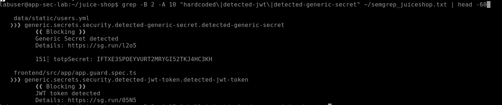
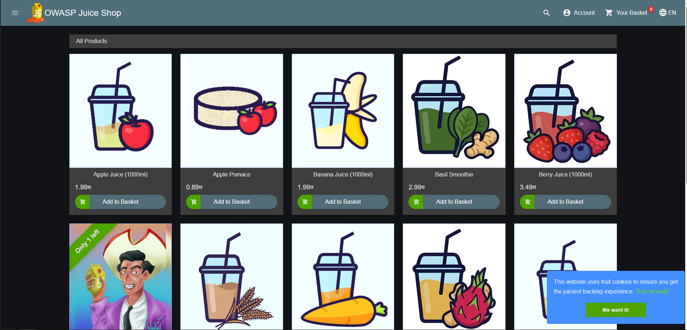
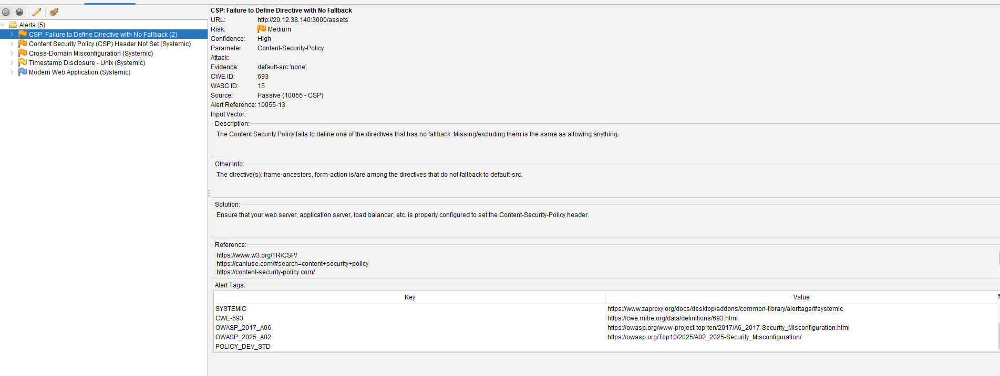
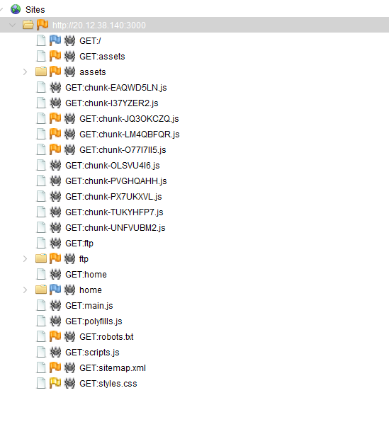

# Application Security Analysis: OWASP Juice Shop

I ran a layered security assessment on OWASP Juice Shop using SAST, SCA, and DAST. The goal was to see where each method finds bugs the others miss, and to triage findings the way a real AppSec team would.

## Why This Project

This project emulates working end-to-end: take a real codebase, run the same kinds of tools a production security team uses, and triage the output into actionable findings instead of just a scanner dump. Without SAST and DAST in the development pipeline, the kinds of bugs caught in this assessment ship straight to production. According to IBM's 2024 Cost of a Data Breach Report, that costs companies an average of $4.88M per incident.

## Overview

Juice Shop is OWASP's intentionally vulnerable web app, used widely as a training target. I scanned it three ways: source code (Semgrep), dependencies (npm audit), and runtime behavior (OWASP ZAP). Running scanners is easy. The harder part, and the whole point of this project, was reading the output, separating real bugs from noise, and noticing where two tools agreed on the same issue.

## Why SAST, SCA, and DAST Together

No single tool catches everything. Each one is built to find a different category of problem, and a real AppSec program runs all three because they cover each other's blind spots:

- **SAST (Static Application Security Testing)** reads source code without running it. It's great at finding patterns like SQL injection, hardcoded secrets, and unsafe function usage. But it can't see how the deployed app actually behaves or what's in third-party dependencies.
- **SCA (Software Composition Analysis)** checks the libraries an app depends on for known CVEs. Modern apps are mostly third-party code. Juice Shop pulls in over 1,500 packages. Even perfectly-written first-party code can ship critical vulnerabilities through a single bad dependency.
- **DAST (Dynamic Application Security Testing)** attacks the running application from the outside, like a real attacker would. It catches runtime issues SAST can't see, like missing security headers, misconfigured CORS, server config problems, and authentication flow bugs.

Skipping any of these leaves a gap. SAST-only misses dependency vulnerabilities. SCA-only misses code-level bugs. DAST-only misses everything that doesn't surface through HTTP. Running all three is how mature AppSec programs operate, and that's why I structured this project around all three.

## Architecture

| Component | Tool | Role |
|-----------|------|------|
| Target | OWASP Juice Shop (Node.js / TypeScript / Angular) | App under test |
| SAST | Semgrep OSS (1,059 community rules) | Source code analysis |
| SCA | npm audit | Dependency CVE scanning |
| DAST | OWASP ZAP (Automated Scan) | Runtime vulnerability detection |
| Host | Azure Ubuntu 24.04 VM | Isolated lab for the vulnerable target |

Juice Shop ran on the Azure VM on port 3000. ZAP attacked it from my Windows host. Semgrep and npm audit ran on the VM directly against the cloned source.

## Methodology

**SAST first.** Ran Semgrep with `--config=auto` so it picked rulesets based on the languages it detected (TypeScript, JavaScript, YAML, HTML, Solidity, JSON, Dockerfile, Bash). It scanned 1,113 files in about 40 seconds and flagged 42 findings.


**SCA in parallel.** `npm audit` against `package.json` pulled up 42 known CVEs in dependencies: 6 critical, 23 high, 9 moderate, 4 low. These are bugs in third-party code that SAST against first-party code won't catch.

**DAST last.** With Juice Shop running, I pointed ZAP's Automated Scan at `http://VM:3000`. ZAP ran its traditional spider, AJAX spider, and active scan to find anything that only shows up at runtime.

**Why this order:** SAST is the fastest and finds the most surface area, so it's a good baseline. SCA is basically free once dependencies are already installed. DAST is the slowest but catches stuff the others can't see, like missing security headers and runtime config issues.

## Findings Breakdown

Here's how the 42 Semgrep findings broke down by rule:


## Key Findings

### 1. SQL Injection (Critical, SAST)

**Location:** `routes/login.ts:34`  
**Rule:** `javascript.sequelize.security.audit.sequelize-injection-express`

User input goes straight into a raw SQL query via template literal:

```javascript
models.sequelize.query(
SELECT * FROM Users WHERE email = '${req.body.email || ''}'     AND password = '${security.hash(req.body.password || '')}'     AND deletedAt IS NULL,
{ model: UserModel, plain: true }
)
```
**Exploit:** Send `' OR 1=1--` as the email. The WHERE clause short-circuits, the rest of the query gets commented out, and you log in as the first user in the database. In Juice Shop, that's the admin account.

**Severity:** This is full auth bypass on the login route, not just data exposure. That's why I rated it critical.

**Business impact:** A single SQL injection on a login endpoint is how some of the largest breaches in history happened. An attacker who lands here gets admin access to every user record, every order, every payment method. For an e-commerce app, that's PII, payment data, and full account takeover, plus GDPR or PCI-DSS fines on top of cleanup costs.

**Fix:** Use Sequelize's parameterized query syntax (`replacements` or `bind`) instead of string-interpolating user input into SQL.


### 2. Path Traversal (High, SAST + DAST agreement)

Four routes serve files with `res.sendFile` and user-controlled paths:

| File | Vulnerable Code |
|------|-----------------|
| `routes/fileServer.ts:33` | `res.sendFile(path.resolve('ftp/', file))` |
| `routes/keyServer.ts:14` | `res.sendFile(path.resolve('encryptionkeys/', file))` |
| `routes/logfileServer.ts:14` | `res.sendFile(path.resolve('logs/', file))` |
| `routes/quarantineServer.ts` | `res.sendFile(path.resolve('ftp/quarantine/', file))` |

`path.resolve` doesn't block `../`, it just resolves the path. So a request like `?file=../../etc/passwd` walks right out of the intended directory. The `keyServer.ts` instance is the worst, because it serves encryption keys. A successful traversal there could pull crypto material used elsewhere in the app.


**Cross-tool confirmation:** ZAP's spider independently hit URLs like `http://VM:3000/home/labuser/juice-shop/node_modules/serve-index/...`, meaning at runtime, the server actually was exposing filesystem paths outside its intended directories. Two different methods, same bug class, same conclusion. That's the kind of correlation that turns a scanner finding into a high-confidence real issue.


**Business impact:** Path traversal on a file-serving endpoint lets attackers read whatever the application user has read access to: config files, credentials, source code, logs with PII. If the keys-serving endpoint is exploited, the attacker pulls cryptographic material and now everything the app encrypts is at risk.

**Fix:** After `path.resolve`, check that the result starts with your allowed directory. If not, reject the request.

### 3. GitHub Actions Shell Injection (High, SAST)

Three workflow files in `.github/workflows/` all do the same unsafe thing:
- `update-challenges-ebook.yml:25`
- `update-challenges-www-legacy.yml:28`
- `update-challenges-www.yml:28`

They drop `${{ github.ref_name }}` straight into `run:` shell scripts. The substitution happens *before* bash sees the command, so if an attacker pushes a branch with a malicious name, that name gets executed as shell code on the runner.

That matters because CI runners have access to repo secrets, package registries, and deployment credentials. This exact attack pattern is how some real-world supply chain incidents started, including the PyTorch dependency compromise in 2022.

**Business impact:** A CI runner compromise isn't contained to the runner. The attacker walks away with deployment credentials, signing keys, and access to your package registry. From there they can publish malicious versions of the company's software to every customer using it. The blast radius is everyone who trusts your build pipeline.

**Fix:** Pass the value through an `env:` block, then reference it as `"$VAR"` in the script. Bash sees a normal variable expansion instead of textual substitution.

Three near-identical instances across three workflows tells me there's probably no security review on CI/CD changes. That's a process finding on top of the technical one.


### 4. Hardcoded Secrets (Medium, SAST)

Two flavors:
- **`data/static/users.yml:151`** has a real-looking TOTP secret (`IFTXE3SP0EYVURT2MRYGI52TKJ4HC3KH`) baked into seed data.
- **JWT tokens and HMAC keys** show up in other source files. These are demo creds, but the same pattern in a production repo would be a critical leak.

Even when secrets are "just for testing," they have a habit of leaking into production environments. Anything that looks like a real credential will get scanned, indexed, and tried against real systems by automated bots.

**Business impact:** Hardcoded secrets in source repos are how a lot of breaches start. GitHub's own data shows millions of credentials get pushed to public repos every year, and attackers scan for them in near-real-time. One leaked AWS key can rack up six figures in crypto-mining bills overnight before anyone notices.

**Fix:** Pull secrets from environment variables or a secret manager. If you need placeholders in fixtures, make them obviously fake (`PLACEHOLDER_DO_NOT_USE`).



### 5. Dependency Vulnerabilities (Mixed, SCA)

`npm audit` flagged 42 CVEs in dependencies: 6 critical, 23 high, 9 moderate, 4 low.

These are supply-chain risk: bugs in code the app pulls in, not code the app's developers wrote. SAST against first-party code can't find these by design.

In a real environment, the next step is figuring out which CVEs are actually reachable from the app's call paths. A lot of dependency vulns sit in code paths the app never hits, so blindly patching every CVE is wasted effort. Tools like Snyk or Semgrep Supply Chain do that reachability analysis.

**Business impact:** Dependency vulnerabilities are how the Log4Shell incident happened in 2021. One vulnerable logging library, and suddenly half the internet was exposed. Affected companies spent months patching, and many got breached before they could. Knowing what's in your dependencies is no longer optional.


### 6. CSP and Header Misconfig (Medium, DAST)

DAST setup, with Juice Shop running on the VM and accessed from the Windows browser:




ZAP's scan produced 5 alerts. The relevant ones:

- **CSP header not set** (Medium). No defense-in-depth against XSS.
- **CSP directive with no fallback** (Medium). Where CSP exists, key directives fall back to permissive defaults.
- **CORS misconfiguration** (Low). Cross-origin settings too loose.
- **Unix timestamp disclosure** (Info). Server leaks internal timestamps.

These are deployment and config issues. SAST can't see them because they only exist at runtime. That's why DAST belongs alongside SAST, not as a replacement.

**Business impact:** A missing CSP header turns every XSS bug in your app into account takeover. CSP is the seatbelt: it won't stop the crash, but it makes the crash survivable. CORS misconfigurations let attacker-controlled origins read responses from your API, including session-authenticated data.




## SAST/DAST Correlation

The single best finding in this assessment was path traversal, because two independent methods found it. Semgrep flagged the four `res.sendFile` calls statically. ZAP's spider, running against the live app with no knowledge of the source code, hit filesystem paths like `/home/labuser/juice-shop/node_modules/...` and confirmed the server actually was exposing them.

When two unrelated approaches agree, that's your high-confidence finding. The whole point of running layered analysis is that each tool fills in the others' blind spots, and when they overlap, you've got real signal.

## False Positives and Tuning

Not every finding was a real bug. Two stood out:

- **`data/static/codefixes/`**. Semgrep flagged code in here, but this directory contains Juice Shop's *intentionally fixed* reference implementations. In a real setup I'd drop a `.semgrepignore` rule on this path.
- **`frontend/src/assets/private/three.js`**. Semgrep timed out on a minified third-party library. Third-party assets shouldn't be in a first-party SAST scan anyway, they belong in SCA scope.

Tuning false positives is a real part of the AppSec job. A scanner that cries wolf gets ignored by developers, and once developers tune it out, your whole shift-left strategy is dead.

## What I'd Build Next

- **CI/CD integration.** Run Semgrep on every PR, gate merges on new High/Critical findings, upload SARIF to GitHub's Security tab.
- **Custom Semgrep rules.** Write rules for project-specific patterns the community ruleset misses (like Juice Shop's exact Sequelize injection signature).
- **Authenticated DAST.** Configure ZAP with valid session cookies so the active scan reaches authenticated endpoints. My unauthenticated run only hit public routes.
- **Reachability-based SCA.** Use a tool that checks whether vulnerable dependency functions are actually called, instead of flagging every CVE in `node_modules`.
- **IaC scanning.** Juice Shop has Dockerfiles and Kubernetes manifests. Running Checkov or tfsec on those extends the analysis to infrastructure.

## Lessons Learned

- **Pick tools that match your platform.** I started with Docker Desktop on Windows for the target environment. After fighting AMD virtualization and Hyper-V conflicts for hours, I switched to an Azure Ubuntu VM. For security tooling that targets Linux, a cloud VM is often the faster path.
- **DAST is only as good as its crawl.** My first ZAP scan finished in 5 minutes with barely anything in the alerts panel. The AJAX spider hadn't fully crawled Juice Shop's Angular routes. SPAs need more crawler configuration than typical multi-page sites, or your active scan ends up with nothing to attack.
